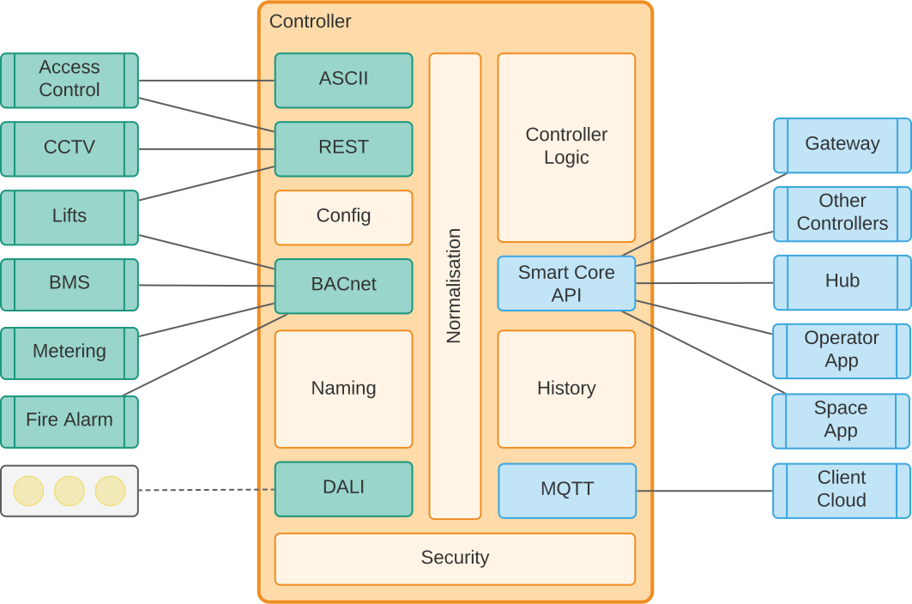
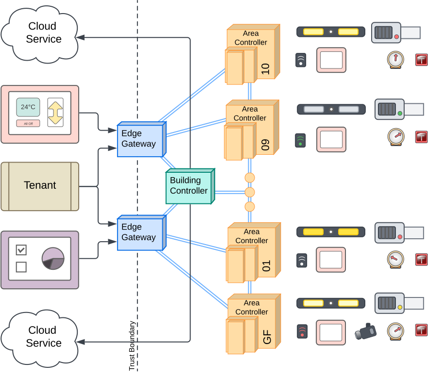

# Smart Core Building Operating System

The Smart Core Building Operating System (SC BOS) is an application and platform for connecting different building
systems together, running actions against those systems, hosting applications, and securing access to buildings data and
control.
The sc bos application will typically be deployed into a physical space or building and will talk to the other systems
installed there like the HVAC, lighting, and security systems.

This repository contains the source code for the sc bos application, bundled applications, and API definitions for third
party access to building systems.

For setting up a development environment, see the [dev guide](docs/install/dev.md).
For an overview of general Smart Core concepts, see the [Smart Core Guide](https://smart-core-os.github.io).
For more details of specific concepts used in sc bos, see the [docs](docs) directory.

## Project Status

This project is under active development.
While we will try to maintain backwards compatibility in the network API, we make no guarantees.
The Go API is also subject to change and should be considered in BETA status.

## Concepts

### Controllers

We call each running instance of sc bos a _controller_, a site might have one or more controllers running throughout the
building.
Each controller has all the features of SC BOS, though some might be turned on or off depending on the requirements of
the installation and the capabilities of the hardware running sc bos.

Controllers serve a comprehensive set of APIs, some [defined in this repo](proto), and some from
the [Smart Core API](https://github.com/smart-core-os/sc-api) repository.
For more detailed SC API documentation see [the API docs](https://smart-core-os.github.com/api/).
Controllers also serve web applications like the [Ops UI](ui/ops) and [Space UI](ui/space) which provide user interfaces
into the data and control of the building.
The API is secured using OAuth2 and OpenID Connect and a role based authn scheme.

SC BOS is designed to be flexible so that it can be used in a variety of different buildings and spaces.
The flexibility comes from _services_ which come in flavours: drivers, autos, zones, and systems.
These services form the basis of the SC BOS plugin system and are config driven.

The services make use of core sc bos features like API publication and routing, auth policy enforcement and security,
lifecycle management and configuration.



### Cohorts

In larger sites, multiple controllers are deployed with distinct and (mostly) non-overlapping responsibilities within
the building.
In these setups there is usually a requirement for the controllers to talk to each other to perform some of their
actions.
Additionally, operators of the building or clients wanting to access the building data via the sc bos API want a single
endpoint they can interrogate to find information on any device or system within the building.

We have given special names to these different controller roles:

- **Area Controller**: An SC BOS controller responsible for the integration and control of devices in a specific area of
  the building.
  This is usually a single floor or a small number of floors. The area controller is responsible for the devices and
  systems in its area, and it can also be responsible for some inter-area behaviour.
- **Building Controller**: An SC BOS controller responsible for picking up global integration tasks and
  automations. This controller is responsible for access to the shared storage for site, holds the source of truth for
  accounts, and acts as a CA for inter-controller trust (aka cohort _hub_).
- **Gateway**: An SC BOS controller responsible for exposing the building API to the outside world.
  This controller is responsible for bringing together all the devices and functions spread throughout the other
  controllers and providing a single API endpoint for the building. The gateway usually hosts the web applications for
  the site, but has no device integrations of its own.



## Navigating this repository

This repository contains the SC BOS application code (written in Go), web applications (written using Vue.js), and
various tools, documentation, and support files like docker files and github actions.

The important directories are:

- `cmd/bos/main.go`: The main entry point for the SC BOS application.
  - `cmd/tools`: Various tools useful for working with this repo or sc bos installations.
- `pkg`: The main application code for SC BOS, where you'll also find:
    - `pkg/app`: The app entrypoint code and main config file structures
    - `pkg/node`: The main API publication and routing package
    - `pkg/driver`, `pkg/auto`, `pkg/zone`, `pkg/system`: Plugins for sc bos, each sub-package contains a single plugin.
    - `pkg/gen` and `pkg/gentrait`: The generated protobuf code goes in `gen` and our hand written utilities around this
      code goes in `gentrait`.
- `ui/*`: Web applications like the [Ops UI](ui/ops) and [Space UI](ui/space).
- `example/config`: Example config files and setups for running sc bos in different ways. Of note is
  the [vanti-ugs](example/config/vanti-ugs) example which is the setup we do most development against, and 
  [hub](example/config/hub) for creating a cohort of controllers.
- `proto`: APIs defined by this project. Service specific APIs can also be found in the system packages.
- `docs`: Detailed documentation and design docs for different features of sc bos.
- `demo`: Pre-built demo applications suitable for non-developers to run and present to clients.

The dev team tend to use JetBrains IDEs (IDEA, GoLand, WebStorm) for development, but you can use any editor you like.
We have provided some run configurations in `.run` for these IDEs to get you started with, for example, running the
vanti-ugs example.

## Using SC BOS in a new building

Most deployments of SC BOS require some custom service, a driver or automation, that does not need to be included in
this repository.
For these buildings we recommend creating a new repository with your own main package and including sc bos as a
dependency.
You can use our `main.go` as a template and add additional services to the system config as needed based on your requirements.

```go
package main

import (
	"context"
	"os"

	"github.com/smart-core-os/sc-bos/pkg/app"
	"github.com/smart-core-os/sc-bos/pkg/app/sysconf"
	"github.com/smart-core-os/sc-bos/pkg/auto/allautos"
	"github.com/smart-core-os/sc-bos/pkg/driver/alldrivers"
	"github.com/smart-core-os/sc-bos/pkg/system/allsystems"
	"github.com/smart-core-os/sc-bos/pkg/zone/allzones"
)

func main() {
	os.Exit(app.RunUntilInterrupt(run))
}

// run is an example entrypoint for a custom sc bos application
func run(ctx context.Context) error {
	systemConfig := sysconf.Default()
	systemConfig.DriverFactories = alldrivers.Factories()
	systemConfig.AutoFactories = allautos.Factories()
	systemConfig.SystemFactories = allsystems.Factories()
	systemConfig.ZoneFactories = allzones.Factories()

	// Add your own driver, auto, zone, or system factories here
	systemConfig.DriverFactories[acme.DriverName] = acme.Factory
	systemConfig.AutoFactories[dosomething.AutoName] = dosomething.Factory

	if err := sysconf.Load(&systemConfig); err != nil {
		return err
	}

	controller, err := app.Bootstrap(ctx, systemConfig)
	if err != nil {
		return err
	}

	return controller.Run(ctx)
}

```
