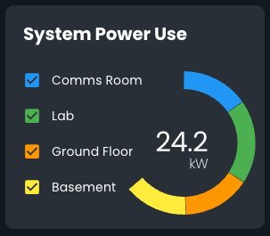

# Dashboards in the Ops UI

The Ops UI has a semi-flexible built-in dashboard system that allows different _widgets_ to be added to a single
dashboard page following a _layout_.
The widgets and layout are all configurable via the ui-config file and can be organised into a hierarchy of pages.


## Getting Started

The easiest way to get started is to run the [Vanti UGS example](../../example/config/vanti-ugs) which includes a
number of dashboards for different use cases.
To make your own dashboard, you can read the [ui-config.json](../../example/config/vanti-ugs/ui-config.json) file,
look for the section under `config.ops.pages` and copy or modify the config as desired for your own site.

To understand what layouts or widgets are available, look in the pallet files:
[layout/pallet.js](../../ui/ops/src/dynamic/layout/pallet.js) and
[widgets/pallet.js](../../ui/ops/src/dynamic/widgets/pallet.js).
To discover which properties each widget accepts, unfortunately you'll need to look in the widget source code and
check the `defineProps` macro.
Some widgets have props passthrough enabled, so you need to also look for that.

> [!TIP]
>
> Yeah, we know this isn't ideal. We do plan to add user-friendly dashboard editing in the future, but for now
> you'll need to figure it out using the sources and edit the JSON file directly.

There's a directly that contains screenshots of all the built-in widgets to help you make a choice when building your
dashboard: [docs/assets/dashboard/widgets](../assets/dashboard/widgets).

<p>



</p>

## How it Works

Each dashboard page is described by a `page` JSON object in the `ui-config.json` file.
The objects are organised into a hierarchy using the `children` property, where each child is another page object.
Each page object has properties to describe the page, such as `title`, `icon`, and `path`,
page objects also specify the layout to use via their `layout` property, which then determines which other properties
can be used to place the widgets into the layout.

The `LayoutMainSide` layout, for example, has a `main` column which takes up all available space, and an `after` column
of fixed size.
An example page config object for this layout might look like this:

```json
{
  "title": "Building Overview",
  "icon": "mdi-domain",
  "layout": "builtin:LayoutMainSide",
  "path": "building",
  "main": [{... widget object ...}, {...}],
  "after": [{... widget object ...}, {...}, {...}]
}
```

To add child pages to this page object you'd add a `children` property, something like this:

```json
{
  ... other page properties ...,
  "children": [
    {... child page object 1 ...},
    {... child page object 2 ...},
    {... child page object 3 ...}
  ]
}
```

You can specify any number of top-level pages or children as deep as you like depending on your use case.


The widgets themselves are also described by JSON objects which say which widget the object represents and props
to configure that widget.

As an example, the `PeopleCountCard` widget config might look like this:

```json
{
  "component": "builtin:occupancy/PeopleCountCard",
  "props": {
    "source": "van/uk/brum/ugs/zones/building",
    "maxOccupancy": 1250
  }
}
```

## Layouts

We provide a few built-in layouts that can be used in different situations to place the widgets on the page.

The MainSide layout uses a column approach with a main column that takes up all available space and an after column of
fixed size, which is useful for placing a sidebar of widgets.
This layout is useful for interactive dashboards, where scrolling is available.


The Grid layout allows you to place widgets in a grid of configurable size.
Each widget is placed using `{x, y, w, h}` into the grid allowing very flexible placement.
This layout is useful for structured dashboards where you known how much information you want to display, for example
on a signage screen or a control room.


## Advanced Usage

### Signage Mode

Some layouts support a _signage mode_ which allows the dashboard to be displayed in a full-screen, non-interactive mode.

To activate this mode, add `?mode=signage` to the URL the signage device is using to access the dashboard.
For layouts like the `LayoutGrid`, this will cause the dashboard to fill the screen (no app bar, nav bar, etc) and
will cause all rows in the grid to get the same height.
