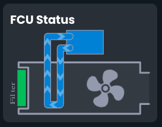
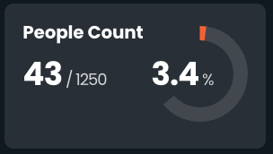
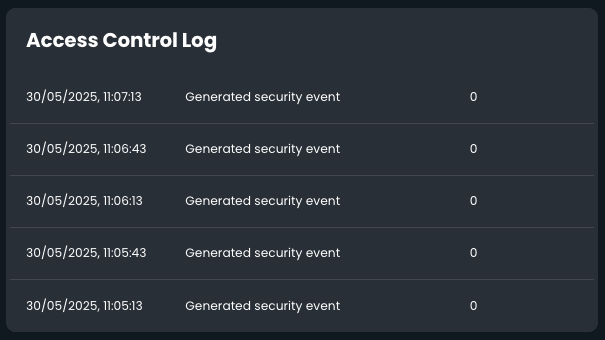

# Dashboard Widgets

## Energy Widgets

### Energy Consumption Widget

Shows the total energy consumed, as measured by meters, over a specified time period.
The time period is something like day, week, month.
Can also show other metered consumption, like water or gas.

### Energy History Widget

Shows the energy consumed over a time period divided into time buckets and stacked by source.
Can show consumption and generation, above and below the line respectively.

### Energy Power Compare Widget

Compares the current power consumption of one or more sources, showing a total.

### Energy Demand History Widget

Shows comparative or stacked historical electrical demand for one or more sources over time.
Has similar controls to the [Energy History Widget](#energy-history-widget), but averages the kW usage over each time
period, rather than summing the kWh used.
Can be configured to show different power metrics such as apparent power (kVA), reactive power (kVAR), or current (A).

### Energy Power Widget

An alternative to the [Energy History Widget](#energy-history-widget) that also shows a total summary.

## Environmental Widgets

### Environmental Air Quality Widget

Shows the current air quality for a single device.

### Environmental Air Quality History Widget

Shows historical readings for a single air quality metric for a single device over time.

### Environmental Card

Shows temperature and humidity readings for one or two devices.

## General Widgets

### General Data and Time Widget

Shows the current date and time.

### General Smart Core Status Widget

Shows the status of the Smart Core cohort, just like on the app toolbar.

### General OpenWeather Map Widget

Shows the current weather for a location using the OpenWeather API.
Needs an API key to work.

## Graphic Widgets

The graphic widget is described by [a dedicated page](../feats/opsui-graphics.md).
This widget can show any SVG graphic and bind it to data sources and make it interactive.

## Notification Widgets

Shows notifications, like the Notifications page.
Supports filtering notifications using any query normally supported by the Notifications page.

## Occupancy Widgets

### Occupancy People Count Widget

Shows the occupancy os a single device, with an optional maximum occupancy limit.

### Occupancy People Count History Widget

Show the people count for a single device over time.

### Occupancy History Widget

An older version of the [Occupancy People Count History Widget](#occupancy-people-count-history-widget)
that shows historical occupancy data and a summary.

## Security Widgets

### Security Events Widget

Shows access control events for a single device, such as door access or security system events.