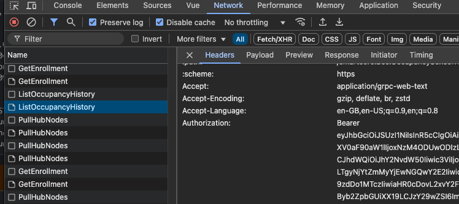

# Profiling performance issues

If your application is having issues with performance, maybe it's running out of memory or using 100% CPU, it's time to
break out the profiler.

SC BOS hosts a number of HTTPS endpoints that you can GET to retrieve profile information about the running program.
These endpoints are defined by the [net/http/pprof](https://golang.org/pkg/net/http/pprof/) Go package and made
available for authenticated users under the `/__/debug/pprof/*` endpoints on your running SC BOS node.
Only local profiling is supported, you can't request a profile dump from a gateway for another node in the cohort.

When authentication is enabled on the SC BOS node, only `admin`, or `super-admin` roles are permitted to access the
`pprof` endpoints.

The `pprof` tool is able to fetch the profile information for you, however it struggles with authenticated endpoints.
Instead, you can use a tool like `curl` to fetch the profile information and save it to a file, then use `go tool pprof`
to inspect that file.

```shell
# Fetch CPU profile information
TOKEN="abc123"
curl -H "Authorization: Bearer $TOKEN" https://localhost:8443/__/debug/pprof/profile > cpu.pb.gz
```

The easiest way to get a token is to log into the Ops UI using a user with the required roles, open DevTools, click on
the network tab, and find a request the Ops UI is making to the server.
Using this request you should be able to see the `Authorization` header with the token in it.
We know this isn't ideal, but it works for now.



Once you have the profile downloaded, I find the easiest way to progress is via the interactive web interface you can
start via:

```shell
# Start pprof in interactive browser mode
go tool pprof -http=':' cpu.pb.gz
```

See https://github.com/google/pprof for more documentation and examples.
See https://go.dev/blog/pprof for an example of how pprof has been used to improve performance of a real application.
